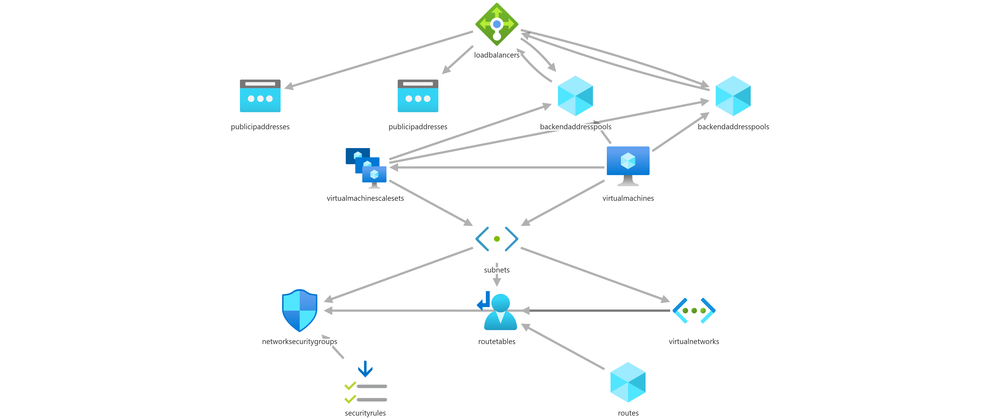

# Azure Dashboard Demo

This markdown file is hosted on github but is used in a custom dashboard on Azure to show that we can surface up project inrformation from markdown from a URL.

## Project diagram

Add code snippets

```csharp
using system.net

namespace Project Namespace

public async Task<obj> Main(){
   ...
}
```

> Note: This is information a reader should notice even when skimming.

- Project diagram

   

- Strikethrough

    ~~The world is flat.~~ We now know that the world is round.

### Task list

- [x] Write the press release
- [ ] Update the website
- [ ] Contact the media

- Emoji

Gone camping! :tent: Be back soon.

That is so funny! :joy:
